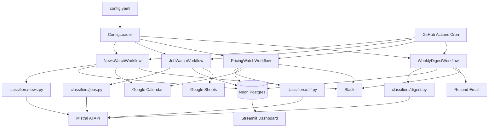

# Architecture

## Data Flow Diagram



---

## Database Tables

### `seen_items`
Prevents the same article, job, or page diff from being acted on twice.

| Column | Type | Description |
|---|---|---|
| `fingerprint` | VARCHAR(64) UNIQUE | `sha256(workflow::identifier)` |
| `workflow` | VARCHAR(50) | Which workflow created this row |
| `item_type` | VARCHAR(50) | `news_article`, `job_posting`, `page_diff` |
| `source_url` | TEXT | Original URL |
| `first_seen` | TIMESTAMPTZ | When first processed |
| `label` | VARCHAR(50) | LLM classification result |
| `acted_on` | BOOLEAN | Whether an action was taken |

Dedup flow: `make_fingerprint(workflow, url)` → sha256 → check `seen_items` → skip if found → process and insert if new.

### `run_log`
Full audit trail for every workflow execution.

| Column | Type | Description |
|---|---|---|
| `workflow` | VARCHAR(50) | Workflow name |
| `trigger_time` | TIMESTAMPTZ | When the run started |
| `items_processed` | INTEGER | Articles / jobs / URLs examined |
| `decisions` | TEXT (JSON) | `[{item_id, label, reasoning}]` |
| `actions_taken` | TEXT (JSON) | `[{action, target, status, detail}]` |
| `errors` | TEXT (JSON) | `[{error, traceback}]` |
| `duration_seconds` | INTEGER | Wall clock time |

The `decisions` array is written **before** any action is taken — every classification has a logged reasoning, making the audit trail tamper-evident.

### `config`
Hot-reloadable config snapshot — always a single row (id=1).

| Column | Type | Description |
|---|---|---|
| `competitors` | TEXT (JSON) | List of competitor objects |
| `criteria` | TEXT | Plain-English `what_i_care_about` string |
| `notifications` | TEXT (JSON) | Slack/calendar/sheet IDs |

`ConfigLoader` writes this row on startup and on every `config.yaml` change (file-watcher). Workflows read from the in-memory dict, not the DB row directly.

### `page_snapshots`
Last-known state of each competitor pricing/product page.

| Column | Type | Description |
|---|---|---|
| `url` | TEXT UNIQUE | Page URL |
| `content_hash` | VARCHAR(64) | `sha256` of normalised text |
| `content_text` | TEXT | Full normalised page text |
| `captured_at` | TIMESTAMPTZ | When last updated |

On first visit a baseline is stored. On subsequent runs the hash is compared; if different, a unified diff is generated and sent to the LLM classifier.

---

## Scheduling

```
Every 2h at :00 UTC ──► news-watch.yml     ──► python -m argus.workflows.news_watch
Daily 8am ──► pricing-watch.yml  ──► python -m argus.workflows.pricing_watch
Daily 9am ──► job-watch.yml      ──► python -m argus.workflows.job_watch
Fri 4pm   ──► weekly-digest.yml  ──► python -m argus.workflows.weekly_digest
Sun 3am   ──► cleanup.yml        ──► DELETE FROM run_log WHERE trigger_time < NOW() - 90d
```

Each GitHub Actions job: checkout → pip install (cached) → run Python script. Typically 60–90 seconds per run.

All workflows support `dry_run=true` (GitHub Actions input): the LLM classifiers still run, but all external writes (Slack, Calendar, Sheets, Email) are skipped.

---

## LLM Classification

All classifiers use `ChatMistralAI.with_structured_output(PydanticModel)` — the model returns JSON matching a Pydantic schema. No regex fallbacks.

```python
class NewsSignal(BaseModel):
    label: Literal["funding", "product_launch", "executive_change", "controversy", "noise"]
    reasoning: str
    confidence: float
```

Labels and their actions:

| Classifier | Labels | Action |
|---|---|---|
| `classify_news` | `funding`, `product_launch` | Google Calendar event |
| `classify_news` | `executive_change`, `controversy` | Slack channel alert |
| `classify_news` | `noise` | No action |
| `classify_job_cluster` | `building_ai_team`, `infra_scaling`, `entering_new_market` | Google Sheets row |
| `classify_job_cluster` | `routine_backfill` | No action |
| `classify_diff` | `material` | Slack DM + channel + Calendar event |
| `classify_diff` | `cosmetic` | No action |

---

## Error Handling

Every integration call goes through `BaseWorkflow._safe_action()`:
- 2 attempts with a 2-second delay between them
- If both fail: error appended to `run_log.errors`, loop continues for the next item
- The run log always has a final saved entry even if every API call failed
- The Streamlit dashboard surfaces errors with full tracebacks

---

## Google Credentials

`integrations/google_auth.py` loads credentials once using `from_service_account_info()` (no temp file on disk):
- **GitHub Actions:** reads `GOOGLE_CREDENTIALS_JSON` env var (JSON string)
- **Local dev:** reads `credentials/google_service_account.json`

Both `google_calendar.py` and `google_sheets.py` call `get_google_credentials(scopes)` from this shared helper.
