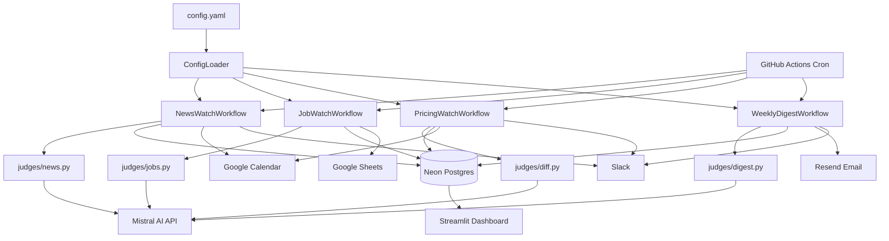

# Architecture

## Data Flow Diagram



## Database Tables

### `seen_items`
Prevents the same article, job, or page diff from being acted on twice.

| Column | Type | Description |
|---|---|---|
| fingerprint | VARCHAR(64) UNIQUE | sha256(workflow::identifier) |
| workflow | VARCHAR(50) | Which workflow created this |
| item_type | VARCHAR(50) | `news_article`, `job_posting`, `page_diff` |
| source_url | TEXT | Original URL |
| first_seen | DATETIME | When first processed |
| label | VARCHAR(50) | LLM classification result |
| acted_on | BOOLEAN | Whether an action was taken |

**Dedup logic:** `make_fingerprint(workflow, url)` → sha256 → check `seen_items` before processing.

### `run_log`
Diary entry for every workflow execution.

| Column | Type | Description |
|---|---|---|
| workflow | VARCHAR(50) | Workflow name |
| trigger_time | DATETIME | When the run started |
| items_processed | INTEGER | Articles/jobs/URLs examined |
| decisions | TEXT (JSON) | `[{item_id, label, reasoning}]` |
| actions_taken | TEXT (JSON) | `[{action, target, status, detail}]` |
| errors | TEXT (JSON) | `[{error, traceback}]` |
| duration_seconds | INTEGER | Wall clock time |

The `decisions` array is what proves all branching is LLM-driven — every classification is logged with its reasoning before any action is taken.

### `config`
Hot-reloadable config snapshot (always one row, id=1).

| Column | Type | Description |
|---|---|---|
| competitors | TEXT (JSON) | List of competitor objects |
| criteria | TEXT | Plain-English `what_i_care_about` string |
| notifications | TEXT (JSON) | Slack/calendar/sheet IDs |

Written from `config.yaml` at the start of each workflow run. Edit `config.yaml` in the repo → merged on the next GH Actions run.

### `page_snapshots`
Stores the last known state of each competitor pricing/product page.

| Column | Type | Description |
|---|---|---|
| url | TEXT UNIQUE | Page URL |
| content_hash | VARCHAR(64) | sha256 of normalized text |
| content_text | TEXT | Full normalized page text |
| captured_at | DATETIME | When last updated |

## Scheduling

```
Every 2h  ──► news-watch.yml    ──► python -m argus.workflows.news_watch
Daily 8am ──► pricing-watch.yml ──► python -m argus.workflows.pricing_watch
Daily 9am ──► job-watch.yml     ──► python -m argus.workflows.job_watch
Fri 4pm   ──► weekly-digest.yml ──► python -m argus.workflows.weekly_digest
Sun 3am   ──► cleanup.yml       ──► DELETE FROM run_log WHERE trigger_time < NOW() - 90d
```

Each GH Actions job: checkout → install deps (cached) → run Python script → done. Typically 60–90 seconds per run.

## LLM Classification

All decisions use `ChatMistralAI.with_structured_output(PydanticModel)` — the model is instructed to return JSON matching a Pydantic schema. This guarantees parseable output with no regex fallbacks.

```python
class NewsJudgment(BaseModel):
    label: Literal["funding", "product_launch", "executive_change", "controversy", "noise"]
    reasoning: str
    confidence: float
```

The `reasoning` field is written to `run_log.decisions` **before** any action is taken. This creates an auditable trail of why each action was taken.

## Error Handling

Every integration call is wrapped in `BaseWorkflow._safe_action()`:
- 2 attempts with 2-second delay
- If both fail: error logged to `run_log.errors`, loop continues for next competitor
- The run log always has a final entry even if every API call failed

The dashboard shows errors prominently with full stack traces so failures are visible without opening GitHub Actions logs.
