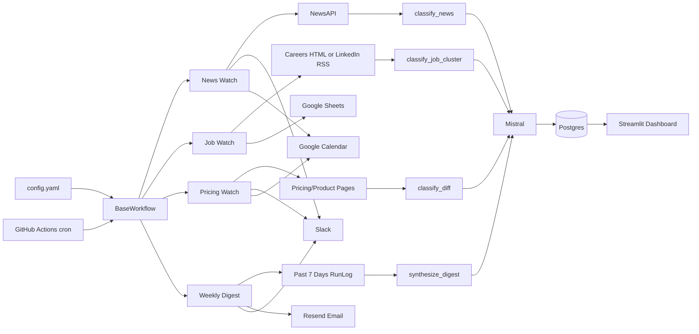
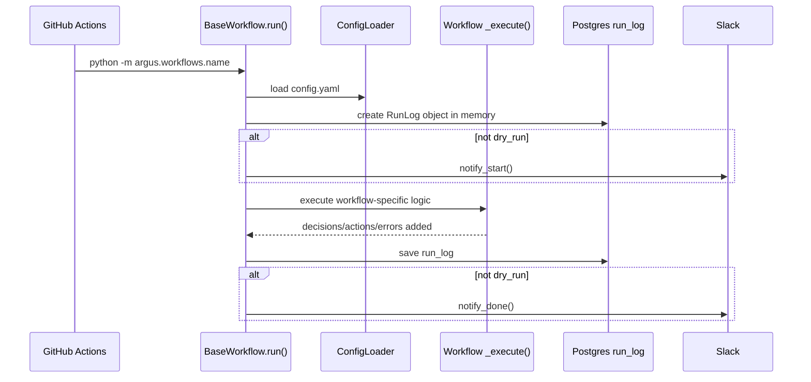
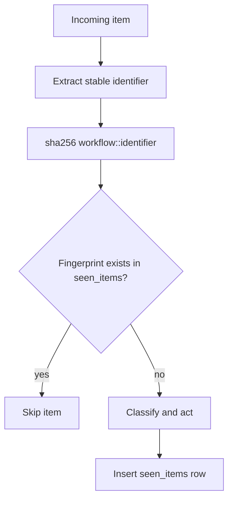
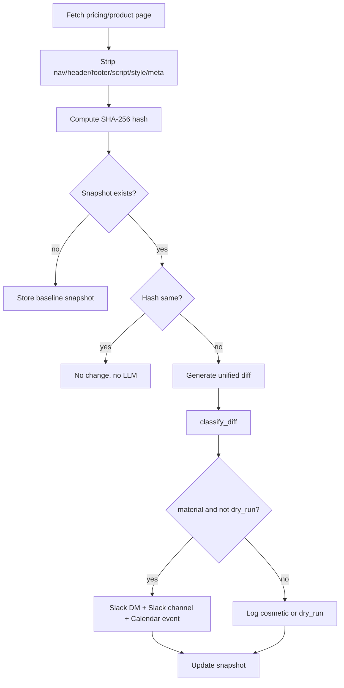
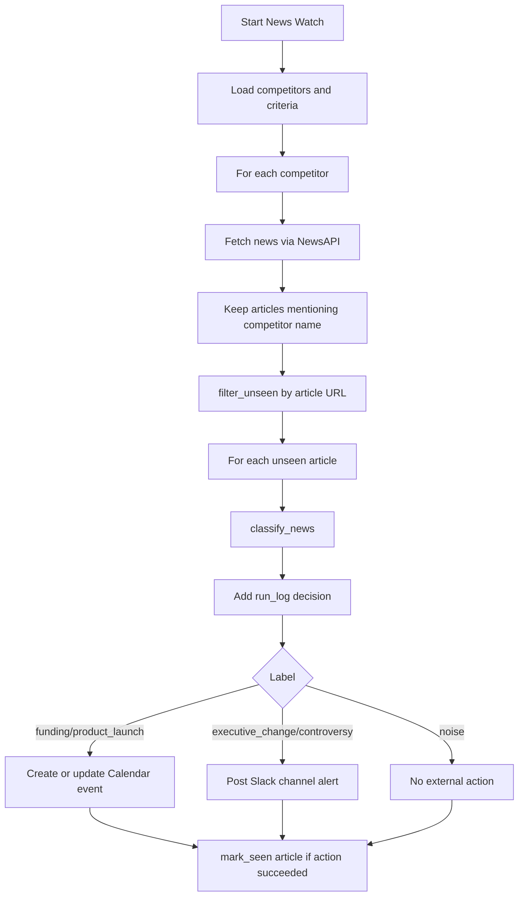
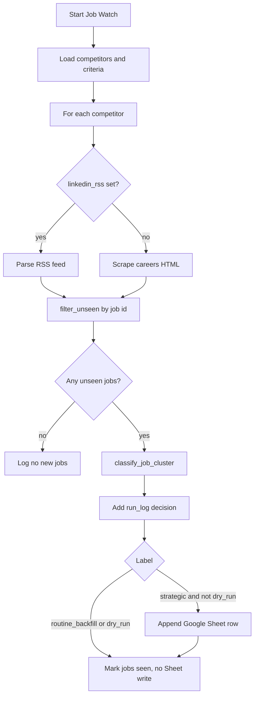
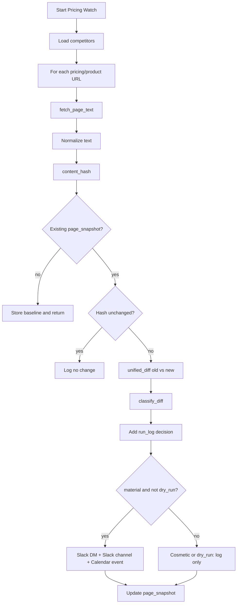
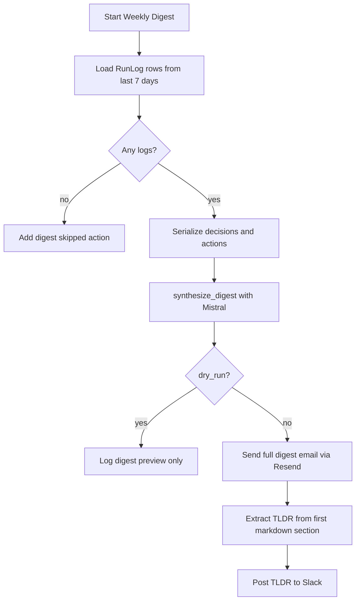
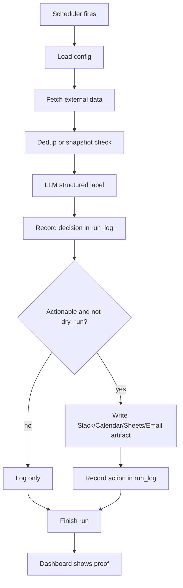

# Argus Workflow Deep Dive and Demo Guide

This document is the step-by-step guide for explaining Argus in a demo, interview, review, or Loom recording. It covers the system architecture, the scheduler, every workflow, all labels, database fields, deduplication logic, action logic, and how the implementation maps to the requirements.

Use it as the source of truth when you need to explain:

- What each workflow does.
- Why each workflow runs on its schedule.
- How the LLM decisions are made.
- What gets written to Slack, Calendar, Sheets, email, and Postgres.
- How duplicate alerts are avoided.
- How to show real evidence from a 48 hour run.

## 1. One Sentence Summary

Argus is an autonomous competitive intelligence agent that runs on GitHub Actions cron, watches configured competitors, classifies news/jobs/pricing changes with Mistral, writes an audit trail to Postgres, and creates real artifacts in Slack, Google Calendar, Google Sheets, and email.

## 2. High Level Architecture



## 3. Requirement Mapping

| Requirement | Implementation | Evidence to show |
|---|---|---|
| Real scheduler | GitHub Actions `schedule` cron in `.github/workflows/*.yml` | GitHub Actions run history showing `Scheduled` runs |
| Runs autonomously | Workflows execute with `python -m argus.workflows.*` and read config/secrets from environment | Workflow YAML and Actions logs |
| Demo running for >=48 hours | `run_log.trigger_time` rows spanning at least 48 hours | Dashboard Demo tab, DB query, Actions history |
| LLM decisions | Mistral classifiers return structured labels using Pydantic schemas | `run_log.decisions`, classifier files |
| Real artifacts | Slack messages, Calendar events, Sheet rows, digest emails | Slack channel/DM, Google Calendar, Google Sheet, Resend/email inbox |
| Audit trail | `run_log` stores items processed, decisions, actions, errors, duration | Dashboard Runs/Decisions/Actions tabs |
| Duplicate prevention | `seen_items` for news/jobs/calendar dedup; `page_snapshots` for pricing changes | DB `seen_items`, `page_snapshots` |
| Dry-run safety | `DRY_RUN=true` classifies but skips external writes | Workflow dispatch input and `dry_run` branches |

## 4. Scheduler Details

Argus uses GitHub Actions as the production scheduler. Scheduled workflows run from the default branch.

| Workflow | File | Cron | Meaning |
|---|---|---|---|
| News Watch | `.github/workflows/news-watch.yml` | `17 */2 * * *` | Every 2 hours at minute 17 UTC |
| Pricing Watch | `.github/workflows/pricing-watch.yml` | `0 8 * * *` | Daily at 08:00 UTC |
| Job Watch | `.github/workflows/job-watch.yml` | `0 9 * * *` | Daily at 09:00 UTC |
| Weekly Digest | `.github/workflows/weekly-digest.yml` | `0 16 * * 5` | Friday at 16:00 UTC |
| DB Cleanup | `.github/workflows/cleanup.yml` | `0 3 * * 0` | Sunday at 03:00 UTC |

News Watch uses minute `17` instead of minute `0` because GitHub scheduled workflows can be delayed during high scheduler load, especially at the top of the hour. The cadence is still every two hours, but offset to reduce delay.

News Watch also has:

```yaml
concurrency:
  group: news-watch-${{ github.ref }}
  cancel-in-progress: true
```

This prevents delayed News Watch runs from overlapping each other.

## 5. Shared Execution Framework

All four main workflows inherit from `BaseWorkflow`.



Shared behavior:

- Loads `config.yaml` through `ConfigLoader`.
- Creates a `RunLog` for the run.
- Optionally sends a Slack start notification.
- Calls the workflow-specific `_execute()`.
- Catches exceptions so one failure does not kill the entire job without a log.
- Saves duration and final `RunLog`.
- Optionally sends a Slack completion notification.

### Safe Action Retry Logic

External calls go through `_safe_action()` when used by workflows.

Algorithm:

1. Try the action once.
2. If it fails, wait 2 seconds.
3. Try again.
4. If it fails again, append an error into `run_log.errors`.
5. Return `None` so the workflow can continue.

This is important because a transient Slack, Calendar, Sheets, API, or scraper failure should not erase the audit trail.

## 6. Configuration

The main runtime config lives in `config.yaml`.

```yaml
competitors:
  - name: "OpenAI"
    news_query: "OpenAI funding product launch announcement"
    careers_url: "https://openai.com/careers"
    linkedin_rss: ""
    pricing_urls:
      - "https://openai.com/api/pricing"
```

Competitor fields:

| Field | Used by | Meaning |
|---|---|---|
| `name` | all workflows | Human-readable competitor name |
| `news_query` | News Watch | Search query passed to NewsAPI |
| `careers_url` | Job Watch | Careers page fallback for job scraping |
| `linkedin_rss` | Job Watch | Optional RSS feed for job listings; blank means fallback to `careers_url` |
| `pricing_urls` | Pricing Watch | Pricing/product URLs to hash, snapshot, and diff |

Criteria field:

| Field | Used by | Meaning |
|---|---|---|
| `criteria.what_i_care_about` | news, jobs, digest | Plain-English business priorities passed to the LLM |

Notification fields:

| Field | Used by | Meaning |
|---|---|---|
| `slack_channel` | news, pricing, digest, base start/done | Slack channel for alerts and status |
| `slack_dm_user` | pricing | Slack user ID for urgent pricing DMs |
| `calendar_id` | news, pricing | Google Calendar target |
| `google_sheet_id` | jobs | Google Sheet target |
| `digest_email` | weekly digest | Email recipient |

LLM fields:

| Field | Used by | Meaning |
|---|---|---|
| `llm.model` | config documentation | Intended model setting in config |
| `llm.temperature` | config documentation | Intended temperature setting in config |

Current classifier code reads `MISTRAL_MODEL` from the environment and defaults to `mistral-small-latest`; temperature is set to `0` inside each classifier. The config values are useful for documenting the intended setup, but they are not currently wired into the classifier constructors.

## 7. Database Schema

Argus has four main ORM models.

### 7.1 `seen_items`

Purpose: deduplicate news articles, job postings, and news calendar events.

| Column | Type | Meaning |
|---|---|---|
| `id` | integer | Auto-increment primary key |
| `fingerprint` | string(64), unique | SHA-256 of `workflow::identifier` |
| `workflow` | string(50) | Workflow that created the row, e.g. `news_watch` |
| `item_type` | string(50) | Kind of item, e.g. `news_article`, `job_posting`, `calendar_dedup` |
| `source_url` | text | URL or stored external ID; for `calendar_dedup`, this stores the Google Calendar event ID |
| `first_seen` | timestamptz | When the item was first marked seen |
| `label` | string(50) | LLM label associated with the item |
| `acted_on` | boolean | Whether the item caused an external action |

Fingerprint algorithm:

```python
fingerprint = sha256(f"{workflow}::{identifier}")
```

Important nuance: Pricing Watch does not currently use `seen_items`. It uses `page_snapshots`.

### 7.2 `run_log`

Purpose: full audit trail for every workflow execution.

| Column | Type | Meaning |
|---|---|---|
| `id` | integer | Auto-increment primary key |
| `workflow` | string(50) | `news_watch`, `job_watch`, `pricing_watch`, or `weekly_digest` |
| `trigger_time` | timestamptz | When the run started |
| `items_processed` | integer | Count of articles/jobs/URLs/logs examined |
| `decisions` | text JSON array | LLM decisions: `[{item_id, label, reasoning}]` |
| `actions_taken` | text JSON array | External actions: `[{action, target, status, detail}]` |
| `errors` | text JSON array | Errors: `[{error, traceback}]` |
| `duration_seconds` | integer | Wall-clock runtime |

Example `decisions` value:

```json
[
  {
    "item_id": "e702e4f6...",
    "label": "funding",
    "reasoning": "The article describes a new capital event."
  }
]
```

Example `actions_taken` value:

```json
[
  {
    "action": "calendar_event",
    "target": "https://calendar.google.com/event/...",
    "status": "created",
    "detail": "https://example.com/article"
  }
]
```

### 7.3 `config`

Purpose: database copy of the current `config.yaml`.

| Column | Type | Meaning |
|---|---|---|
| `id` | integer | Always `1` |
| `updated_at` | timestamptz | Last config sync time |
| `competitors` | text JSON | Competitor list |
| `criteria` | text | Plain-English criteria |
| `notifications` | text JSON | Notification targets |

Workflows read the in-memory config from `ConfigLoader`, not this table directly. The table is useful for observability.

### 7.4 `page_snapshots`

Purpose: remember the last known text/hash for pricing and product pages.

| Column | Type | Meaning |
|---|---|---|
| `id` | integer | Auto-increment primary key |
| `url` | text unique | Pricing/product page URL |
| `content_hash` | string(64) | SHA-256 of cleaned page text |
| `content_text` | text | Cleaned page text |
| `captured_at` | timestamptz | Last snapshot update |

Pricing Watch uses this table instead of `seen_items` because it needs to compare "previous version" against "current version".

## 8. Deduplication and Snapshot Logic

### 8.1 News and Job Dedup



Stable identifiers:

| Workflow | Identifier |
|---|---|
| News Watch | Article URL |
| Job Watch | Job ID or job URL |
| Calendar dedup | `calendar::{competitor}::{label}::{UTC date}` |

### 8.2 Pricing Snapshot Logic



First run behavior: store baseline only. No classifier and no action.

## 9. Workflow 1: News Watch

### Purpose

News Watch monitors competitor news, filters out unrelated articles, classifies unseen articles, and acts on important competitive events.

### Schedule

GitHub Actions cron:

```yaml
cron: '17 */2 * * *'
```

Meaning: every 2 hours at minute 17 UTC.

### Inputs

From `config.yaml`:

- `competitors[].name`
- `competitors[].news_query`
- `criteria.what_i_care_about`
- `notifications.slack_channel`
- `notifications.calendar_id`

From GitHub Secrets:

- `DATABASE_URL`
- `MISTRAL_API_KEY`
- `NEWSAPI_KEY`
- `SLACK_BOT_TOKEN`
- `GOOGLE_CREDENTIALS_JSON`
- `CALENDAR_ID`

### Algorithm



Detailed steps:

1. Load observer criteria and notification settings.
2. Loop through competitors.
3. Call `fetch_news(competitor["news_query"])`.
4. Filter out results that do not mention the competitor name in title or description.
5. Convert articles into items shaped like `{"url": article.url, "_article": article}`.
6. Call `filter_unseen(items, "news_watch", "url")`.
7. For each unseen article:
   - call `classify_news(vars(article), criteria)`.
   - append decision to `run_log.decisions`.
   - act based on label and `dry_run`.
   - mark article seen if appropriate.

### News Labels

| Label | Meaning | Action when not dry run |
|---|---|---|
| `funding` | Investment round, acquisition, or significant capital event | Create or update Google Calendar strategy review event |
| `product_launch` | New product, major feature release, or public beta | Create or update Google Calendar strategy review event |
| `executive_change` | CEO/CTO/VP departure, hire, or board change | Post Slack channel alert |
| `controversy` | Legal issue, breach, backlash, regulatory action | Post Slack channel alert |
| `noise` | Blog post, award, minor update, recycled news, unrelated article | Log only |

Fallback: if the LLM returns an invalid label, classifier defaults to `noise`.

### Calendar Dedup Logic

News Watch has special dedup logic for Calendar events.

Goal: if three articles report the same OpenAI funding story on the same day, create one calendar event and append later article URLs to that event.

Calendar dedup fingerprint:

```text
news_watch::calendar::{competitor_name_lowercase}::{label}::{today_utc}
```

Stored as:

| Field | Value |
|---|---|
| `workflow` | `news_watch` |
| `item_type` | `calendar_dedup` |
| `source_url` | Google Calendar `event_id`, not a URL |
| `label` | `funding` or `product_launch` |
| `acted_on` | `true` |

If a matching `calendar_dedup` row exists:

1. Read existing Calendar event ID from `source_url`.
2. Append the new article URL to the event description.
3. Log action as `calendar_event` with status `updated`.

If it does not exist:

1. Create a new event for tomorrow.
2. Store the returned event ID in `seen_items.source_url`.
3. Log action as `calendar_event` with status `created`.

### Artifacts to Show

- GitHub Actions scheduled run for News Watch.
- `run_log` row for `news_watch`.
- `run_log.decisions` with news labels.
- Slack alert for `executive_change` or `controversy`.
- Calendar event for `funding` or `product_launch`.
- `seen_items` rows with `news_article`.
- `seen_items` row with `calendar_dedup`.

## 10. Workflow 2: Job Posting Watch

### Purpose

Job Watch detects new job postings and asks the LLM to infer strategic intent from the cluster of new roles.

The important design choice: jobs are classified as a batch per competitor, not one by one. This reduces noise and lets the LLM identify patterns like "building AI team" or "infra scaling".

### Schedule

GitHub Actions cron:

```yaml
cron: '0 9 * * *'
```

Meaning: daily at 09:00 UTC.

### Inputs

From `config.yaml`:

- `competitors[].name`
- `competitors[].linkedin_rss`
- `competitors[].careers_url`
- `criteria.what_i_care_about`
- `notifications.google_sheet_id`

From GitHub Secrets:

- `DATABASE_URL`
- `MISTRAL_API_KEY`
- `SLACK_BOT_TOKEN`
- `GOOGLE_CREDENTIALS_JSON`
- `GOOGLE_SHEET_ID`

### Fetching Logic

```python
if competitor.get("linkedin_rss"):
    scrape_jobs_rss(linkedin_rss)
else:
    scrape_jobs_html(careers_url)
```

`linkedin_rss: ""` means "no RSS feed configured, use HTML scraping".

### Algorithm



Detailed steps:

1. Load observer criteria and Google Sheet ID.
2. Loop through competitors.
3. Fetch raw jobs:
   - RSS if `linkedin_rss` is configured.
   - otherwise heuristic HTML scraping from `careers_url`.
4. Increment `run_log.items_processed` by total raw jobs.
5. Deduplicate jobs using job `id`.
6. If there are no unseen jobs, log and continue.
7. Send the unseen job cluster to Mistral.
8. Append one LLM decision to `run_log.decisions`.
9. If label is strategic and not dry run, append one row to Google Sheets.
10. Mark every unseen job as seen.

### Job Labels

| Label | Meaning | Action when not dry run |
|---|---|---|
| `infra_scaling` | Many SRE, DevOps, platform, reliability, or infrastructure roles suggesting rapid scaling | Append Google Sheet row |
| `entering_new_market` | Roles requiring geography, language, domain, vertical, or market expertise new to the company | Append Google Sheet row |
| `building_ai_team` | ML engineer, AI researcher, LLM specialist, AI product roles | Append Google Sheet row |
| `routine_backfill` | Normal hiring, replacements, generic growth, administrative roles | Log only |

Fallback: if the LLM returns an invalid label, classifier defaults to `routine_backfill`.

### Google Sheet Row

`append_signal_row()` writes columns A-E:

| Column | Meaning |
|---|---|
| A | Detected timestamp |
| B | Competitor |
| C | Label |
| D | Reasoning |
| E | Source URL, currently `careers_url` |

The integration also applies black text formatting to the appended row.

### Artifacts to Show

- GitHub Actions scheduled run for Job Watch.
- Google Sheet row with label and reasoning.
- `run_log` row with `workflow = job_watch`.
- `seen_items` rows with `item_type = job_posting`.
- Dashboard Demo tab artifact checklist showing Sheet rows observed.

## 11. Workflow 3: Pricing and Site Change Watch

### Purpose

Pricing Watch detects material changes on competitor pricing or product pages by comparing the current page against the previous snapshot.

### Schedule

GitHub Actions cron:

```yaml
cron: '0 8 * * *'
```

Meaning: daily at 08:00 UTC.

### Inputs

From `config.yaml`:

- `competitors[].name`
- `competitors[].pricing_urls`
- `notifications.slack_channel`
- `notifications.slack_dm_user`
- `notifications.calendar_id`

From GitHub Secrets:

- `DATABASE_URL`
- `MISTRAL_API_KEY`
- `SLACK_BOT_TOKEN`
- `GOOGLE_CREDENTIALS_JSON`
- `CALENDAR_ID`

### Algorithm



Detailed steps:

1. Load Slack channel, Slack DM user, Calendar ID, and competitors.
2. Loop through every URL in each competitor's `pricing_urls`.
3. Fetch the page.
4. Strip boilerplate tags: `script`, `style`, `nav`, `footer`, `header`, `meta`.
5. Collapse whitespace to produce normalized text.
6. Hash the normalized text with SHA-256.
7. Load existing snapshot from `page_snapshots`.
8. If no snapshot exists:
   - store baseline.
   - return.
   - no LLM and no action.
9. If snapshot hash equals current hash:
   - log "No change detected".
   - return.
10. If hash differs:
   - generate unified diff from old text to new text.
   - classify diff with Mistral.
   - store decision in `run_log.decisions`.
11. If label is `material` and not dry run:
   - send Slack DM.
   - post Slack channel alert.
   - create Google Calendar event.
   - append three actions to `run_log.actions_taken`.
12. If label is `cosmetic` or dry run:
   - log only.
13. Update the page snapshot to the new page version.

### Pricing Labels

| Label | Meaning | Action when not dry run |
|---|---|---|
| `material` | Price changes, new tiers, removed plans, new feature announcements, changed positioning | Slack DM, Slack channel post, Calendar event |
| `cosmetic` | Typo fixes, image swaps, color changes, testimonials, minor copy tweaks | Log only |

Fallback: if the LLM returns an invalid label, classifier defaults to `cosmetic`.

### Calendar Event Details

Pricing Watch calls:

```python
create_strategy_event(
    calendar_id,
    f"Pricing change: {competitor}",
    f"{summary}\n\nPage: {url}",
    datetime.now(timezone.utc),
    30,
)
```

The Google Calendar integration creates the event at 09:00 UTC on the given date for 30 minutes. So Pricing Watch creates a same-day event titled:

```text
Pricing change: {competitor}
```

### First Run Behavior

First time a URL is watched:

- Page text is fetched.
- Hash is calculated.
- Snapshot is stored.
- No LLM call.
- No Slack or Calendar action.

This is expected because there is no previous version to compare against.

### Artifacts to Show

- `page_snapshots` row for a pricing URL baseline.
- `run_log` decision for a changed page.
- Slack DM urgent alert.
- Slack channel alert.
- Calendar event titled `Pricing change: {competitor}`.
- Dashboard Demo tab "Pricing snapshots" evidence.

## 12. Workflow 4: Weekly Digest

### Purpose

Weekly Digest summarizes the previous week's workflow activity into an executive markdown digest and distributes it by email plus Slack TL;DR.

### Schedule

GitHub Actions cron:

```yaml
cron: '0 16 * * 5'
```

Meaning: Friday at 16:00 UTC.

### Inputs

From `config.yaml`:

- `criteria.what_i_care_about`
- `notifications.slack_channel`
- `notifications.digest_email`

From GitHub Secrets:

- `DATABASE_URL`
- `MISTRAL_API_KEY`
- `SLACK_BOT_TOKEN`
- `RESEND_API_KEY`
- `RESEND_FROM_EMAIL`

### Algorithm



Detailed steps:

1. Compute cutoff: now minus 7 days.
2. Load all non-digest `RunLog` rows since cutoff.
3. If no logs exist:
   - add action `digest/skipped/no_data`.
   - return.
4. Serialize each run into plain text:
   - workflow name.
   - trigger time.
   - decisions.
   - actions.
5. Ask Mistral to produce markdown with:
   - `## Key Developments (ranked by strategic importance)`
   - `## What To Watch Next Week`
   - `## Full Signal Log`
6. If not dry run:
   - send email through Resend.
   - extract the first markdown section as TL;DR.
   - post to Slack.
   - log `email` and `slack_post` actions.

### Digest Output Requirements

The digest prompt requires:

- Markdown format.
- Direct bullet points.
- Date and competitor cited for each item.
- Key developments ranked by strategic importance.
- Empty sections omitted.

### Artifacts to Show

- Digest email in inbox.
- Slack weekly digest TL;DR.
- `run_log` row with `workflow = weekly_digest`.
- `run_log.actions_taken` containing `email` and `slack_post`.

## 13. Cleanup Workflow

Cleanup is a maintenance GitHub Actions workflow, not an LLM workflow.

Schedule:

```yaml
cron: '0 3 * * 0'
```

Meaning: Sunday at 03:00 UTC.

Logic:

1. Install minimal DB dependencies.
2. Calculate cutoff: now minus 90 days.
3. Delete old rows from `run_log`.

It keeps the audit table from growing forever while preserving recent evidence.

## 14. Action Matrix

| Workflow | Label/Condition | External action |
|---|---|---|
| News Watch | `funding` | Calendar event created or updated |
| News Watch | `product_launch` | Calendar event created or updated |
| News Watch | `executive_change` | Slack channel alert |
| News Watch | `controversy` | Slack channel alert |
| News Watch | `noise` | No external action |
| Job Watch | `infra_scaling` | Google Sheet row |
| Job Watch | `entering_new_market` | Google Sheet row |
| Job Watch | `building_ai_team` | Google Sheet row |
| Job Watch | `routine_backfill` | No external action |
| Pricing Watch | `material` | Slack DM, Slack channel alert, Calendar event |
| Pricing Watch | `cosmetic` | No external action |
| Weekly Digest | logs exist and not dry run | Digest email and Slack TL;DR |
| Weekly Digest | no logs | `digest` skipped action only |

## 15. Dry Run Behavior

Dry run is controlled by the GitHub Actions `workflow_dispatch` input and passed as `DRY_RUN`.

`BaseWorkflow.main()` reads:

```python
dry = os.getenv("DRY_RUN", "false").lower() == "true"
```

Dry run behavior:

| Workflow | What still happens | What is skipped |
|---|---|---|
| News Watch | Fetch, filter, classify, decisions, seen marking for most paths | Slack and Calendar writes |
| Job Watch | Fetch, dedup, classify, decisions, seen marking | Google Sheet writes |
| Pricing Watch | Fetch, hash, diff, classify if changed, snapshot update | Slack and Calendar writes |
| Weekly Digest | Load logs, synthesize digest | Email and Slack writes |

Use dry run for testing classifier and DB behavior without external artifacts.

## 16. Error Handling and Reliability

Reliability features:

- `_safe_action()` retries workflow actions once.
- Errors are stored in `run_log.errors`.
- The workflow loop continues after most per-item failures.
- `BaseWorkflow.run()` catches workflow-level exceptions and still saves a run log.
- Slack start/done notifications are best-effort and do not fail the workflow if Slack is down.
- News Watch has GitHub Actions concurrency to avoid overlap.
- News and Job Watch use `seen_items` to avoid repeated processing.
- Pricing Watch uses `page_snapshots` to avoid repeated diff alerts.

What to show:

- Dashboard "Errors" tab.
- `run_log.errors` values.
- GitHub Actions logs.

## 17. Dashboard Demo Tab

The Streamlit dashboard has a Demo tab designed for presentation.

It shows:

- Cron workflows.
- Run-log span.
- Runs in the last 48 hours.
- Artifact checklist.
- Architecture graph.
- Scheduler proof table from the actual `.github/workflows/*.yml` files.
- Pricing snapshots.
- Seen item summary.
- Loom narration text.

Run it locally:

```bash
streamlit run argus/dashboard/app.py
```

If port 8501 is busy:

```bash
streamlit run argus/dashboard/app.py --server.port 8502
```

## 18. Useful SQL Queries for Demo Evidence

### 18.1 Show 48 Hour Run History

```sql
select workflow, trigger_time, items_processed, duration_seconds, decisions, actions_taken, errors
from run_log
where trigger_time >= now() - interval '48 hours'
order by trigger_time desc;
```

### 18.2 Show Full Run Span

```sql
select min(trigger_time) as first_run,
       max(trigger_time) as last_run,
       extract(epoch from max(trigger_time) - min(trigger_time)) / 3600 as span_hours,
       count(*) as total_runs
from run_log;
```

### 18.3 Show Recent Actions

```sql
select workflow, trigger_time, actions_taken
from run_log
where actions_taken <> '[]'
order by trigger_time desc;
```

### 18.4 Show Seen Items

```sql
select workflow, item_type, label, acted_on, source_url, first_seen
from seen_items
order by first_seen desc;
```

### 18.5 Show Calendar Dedup Rows

```sql
select fingerprint, workflow, item_type, source_url as calendar_event_id, label, first_seen
from seen_items
where item_type = 'calendar_dedup'
order by first_seen desc;
```

### 18.6 Show Pricing Snapshots

```sql
select url, left(content_hash, 12) as hash_prefix, captured_at
from page_snapshots
order by captured_at desc;
```

## 19. How to Introduce the Results in a 3-5 Minute Loom

### Recommended Structure

#### 0:00-0:30 - Open with the promise

Say:

```text
Argus is an autonomous competitive intelligence agent. It runs on a real scheduler, watches competitor news, job postings, and pricing pages, classifies signals with an LLM, and creates real Slack, Calendar, Sheets, and email artifacts.
```

Show:

- Streamlit Dashboard Demo tab.
- Architecture graph.

#### 0:30-1:15 - Show the scheduler

Say:

```text
The scheduler is GitHub Actions cron. These are not manually triggered demo scripts. News Watch runs every two hours at :17 UTC, Pricing Watch runs daily at 8am UTC, Job Watch runs daily at 9am UTC, and the Weekly Digest runs Fridays at 4pm UTC.
```

Show:

- GitHub Actions page.
- Runs marked `Scheduled`.
- Multiple News Watch runs across the day.
- Dashboard "Scheduler proof" table.

Important note:

```text
GitHub scheduled runs are best-effort, so exact start times can drift, but the trigger source is scheduled and the run history spans the required window.
```

#### 1:15-2:00 - Explain data and decisions

Say:

```text
Each workflow creates a run_log entry. The decisions field stores the LLM label and reasoning; actions_taken stores what the system actually did; errors stores any integration failures.
```

Show:

- Dashboard Decisions tab.
- Dashboard Runs tab.
- A `run_log` DB row.

#### 2:00-2:45 - Show each workflow's action

Say:

```text
News Watch turns funding or product launches into calendar events, and executive changes or controversies into Slack alerts. Job Watch clusters new roles and writes strategic hiring signals to Google Sheets. Pricing Watch snapshots pages, diffs changes, and sends urgent Slack plus Calendar alerts for material changes.
```

Show:

- Slack alert.
- Calendar event.
- Google Sheet row.
- `page_snapshots`.

#### 2:45-3:30 - Show dedup and reliability

Say:

```text
The system avoids duplicate work. News and jobs use seen_items fingerprints. Pricing uses page_snapshots because it needs previous page state. News also has calendar_dedup rows so multiple articles about the same funding event update one calendar event instead of creating duplicates.
```

Show:

- `seen_items` rows.
- `calendar_dedup` row.
- `page_snapshots` row.
- Dashboard Database audit trail expander.

#### 3:30-4:15 - Show the 48 hour proof

Say:

```text
The hard requirement was a real scheduler running for at least 48 hours. The dashboard shows the run-log span and the last 48 hours of runs. GitHub Actions also shows the scheduled trigger source.
```

Show:

- Dashboard metric `Run-log span`.
- Dashboard table `Last 48 hours`.
- GitHub Actions scheduled run list.

#### 4:15-5:00 - Close with the value

Say:

```text
The important thing is that this is not just scraping. It is an autonomous loop: scheduled collection, LLM classification, deduplication, external action, and auditability. The artifacts are real and traceable back to run_log decisions.
```

Show:

- Artifact checklist.
- Final Slack/Calendar/Sheet artifact.

## 20. Results Checklist Before Recording

Use this before you start the Loom.

| Item | Where to verify |
|---|---|
| News Watch scheduled runs exist | GitHub Actions -> News Watch |
| At least 48 hours of run history | Dashboard Demo tab or `run_log` SQL |
| Slack alert exists | Slack channel |
| Pricing DM exists, if material pricing change happened | Slack DM |
| Calendar event exists | Google Calendar |
| Sheet row exists | Google Sheet |
| Weekly digest exists, if Friday run happened | Email inbox and Slack |
| `run_log` rows exist | Dashboard Runs tab or DB |
| `seen_items` rows exist | Dashboard Demo tab or DB |
| `page_snapshots` rows exist | Dashboard Demo tab or DB |
| No exposed secrets on screen | Hide `.env`, GitHub Secrets, service account JSON |

## 21. Common Questions and Answers

### Is the scheduler real?

Yes. GitHub Actions cron triggers workflows automatically. In the Actions UI, scheduled runs show as `Scheduled`, not `workflow_dispatch`.

### Why are News Watch run times not exactly every two hours?

GitHub scheduled workflows are best-effort and can be delayed. The workflow was moved from minute `0` to minute `17` to avoid the busiest scheduler minute. The cadence remains every two hours.

### What happens on the first Pricing Watch run?

It stores a baseline snapshot only. There is no previous version to diff, so no LLM classification and no alert.

### Why does Pricing Watch use `page_snapshots` instead of `seen_items`?

Pricing Watch needs to compare the current page to the previous page version. `seen_items` is good for one-off items like articles and jobs; `page_snapshots` is better for evolving page state.

### What is `calendar_dedup`?

It is a `seen_items` row that prevents duplicate Calendar events for the same competitor, same news label, and same UTC date. Its `source_url` stores the Google Calendar event ID.

### Does dry run create external artifacts?

No. Dry run still fetches/classifies/logs, but skips external writes like Slack, Calendar, Sheets, and email.

### Where are decisions stored?

In `run_log.decisions` as JSON objects with `item_id`, `label`, and `reasoning`.

### Where are actions stored?

In `run_log.actions_taken` as JSON objects with `action`, `target`, `status`, and `detail`.

### How do we know the LLM used valid labels?

Each classifier uses Pydantic models with `Literal[...]` label fields. Invalid structured output falls back to safe labels: `noise`, `routine_backfill`, or `cosmetic`.

## 22. File Map

| Area | File |
|---|---|
| News workflow | `argus/workflows/news_watch.py` |
| Job workflow | `argus/workflows/job_watch.py` |
| Pricing workflow | `argus/workflows/pricing_watch.py` |
| Weekly digest workflow | `argus/workflows/weekly_digest.py` |
| Shared workflow base | `argus/workflows/base.py` |
| News classifier | `argus/classifiers/news.py` |
| Jobs classifier | `argus/classifiers/jobs.py` |
| Diff classifier | `argus/classifiers/diff.py` |
| Digest classifier | `argus/classifiers/digest.py` |
| Dedup helpers | `argus/core/dedup.py` |
| DB models | `argus/core/models.py` |
| Dashboard | `argus/dashboard/app.py` |
| Slack integration | `argus/integrations/slack_client.py` |
| Calendar integration | `argus/integrations/google_calendar.py` |
| Sheets integration | `argus/integrations/google_sheets.py` |
| Email integration | `argus/integrations/resend_client.py` |
| Scheduler files | `.github/workflows/*.yml` |

## 23. One Page Mental Model



That loop is the heart of Argus.
